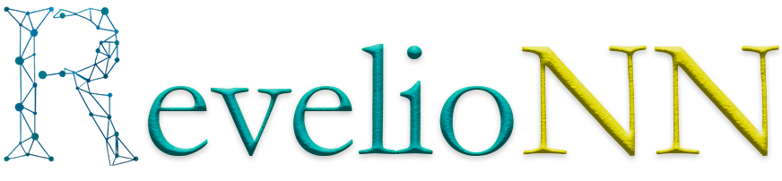
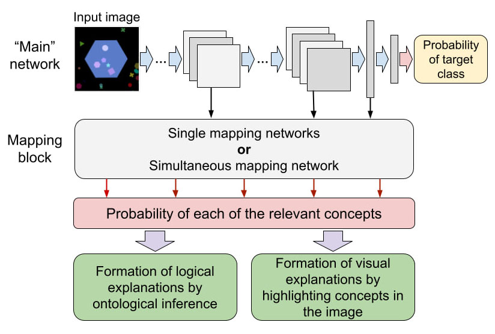
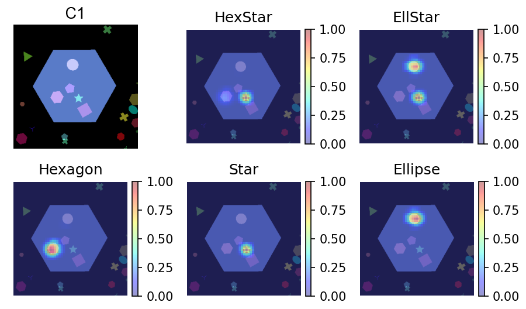

<p align="center">
<br/>
<b>Retrospective Extraction of Visual and Logical Insights for Ontology-based interpretation of Neural Networks</b>
</p>

[](https://revelionn.readthedocs.io/en/latest/)
[](https://pypi.org/project/revelionn/)
[](https://pepy.tech/project/revelionn)
[](https://github.com/cais-lab/revelionn/blob/main/LICENSE)

<b>RevelioNN</b> is an open-source library of post-hoc algorithms for explaining predictions of deep convolutional 
neural networks of binary classification using ontologies. The algorithms are based on the construction of mapping 
networks linking the internal representations of a convolutional neural network with ontology concepts. 
The inspiration for the development of this library was a paper in which this approach to the interpretation of 
neural networks was proposed:

*  M. de Sousa Ribeiro and J. Leite, “Aligning Artificial Neural Networks and Ontologies towards Explainable AI,” in 35th AAAI Conference on Artificial Intelligence, AAAI 2021, May 2021, vol. 6A, no. 6, pp. 4932–4940. doi: [10.1609/aaai.v35i6.16626](https://doi.org/10.1609/aaai.v35i6.16626).

The RevelioNN library was presented in the following paper:

* A. Agafonov and A. Ponomarev, “RevelioNN: Retrospective Extraction of Visual and Logical Insights for Ontology-Based Interpretation of Neural Networks,” Conf. Open Innov. Assoc. Fruct, pp. 3–9, 2023, doi: [10.23919/fruct60429.2023.10328156](https://doi.org/10.23919/FRUCT60429.2023.10328156).
## How the library works
The convolutional neural network, whose predictions need to be explained, is called “main” network. When an image is 
passed through it, the output is a probability of some target class, which at the same time is a concept of ontology. 
Activations of the “main” network produced as a result of image passing represent input data for the mapping networks. 
The outputs of the mapping networks are the probabilities of each of the concepts relevant to the target class, that is, 
the concepts that are involved in its definition. Knowing the probabilities of each of the concepts, it becomes possible 
to form logical and visual explanations.

<p align="center">
  
</p>

### Logical Explanations
By extracting relevant concepts, it is possible to form logical explanations about the belonging of the sample to the 
target concept, accompanied by a set of axioms of ontology.
The input image presented in the scheme was taken from the [SCDB dataset](https://github.com/adriano-lucieri/SCDB), with which the “main” network and mapping networks were trained. 
This image belongs to class <i>C1</i>. The image is classified as <i>C1</i> if the concepts <i>Hexagon</i> ⊓ <i>Star</i> or 
<i>Ellipse</i> ⊓ <i>Star</i> or <i>Triangle</i> ⊓ <i>Ellipse</i> ⊓ <i>Starmarker</i> are present. An example of a logical 
explanation by ontological inference for this sample is given below.

```console
 The image is classified as ['C1'].

 The following concepts were extracted from the image:
 ['HexStar', 'EllStar', 'NotTEStarmarker', 'Hexagon', 'Star', 'Ellipse', 'NotTriangle', 'NotStarmarker']
 with the following probabilities:
 [0.99938893, 0.99976605, 0.9937676684930921, 0.99947304, 0.9999995, 0.99962604, 0.9861229043453932, 0.9810010809451342]

 Justification for '__input__ Type C1':	(Degree of Belief: 0.99963)
 	__input__ Type has some Star	("0.9999995")
 	__input__ Type has some Ellipse	("0.99962604")
 	(has some Ellipse) and (has some Star) SubClassOf EllStar
 	C1 EquivalentTo EllStar or HexStar or TEStarmarker
```

Each of the extracted concepts corresponds to a certain probability, which is then used to calculate the degree of 
confidence of the justifications. The list of possible justifications is ranked by the degree of trust.
If any concept has not been extracted, then we can say that the opposite concept has been extracted, the name of which 
is automatically formed by adding the prefix 'Not'.

The above example shows one of the explanations from the list of possible explanations. It can be interpreted as 
follows. The concepts of <i>Star</i> and <i>Ellipse</i> were extracted from the image. Therefore, based on the axiom of ontology that 
the conjunction of the concepts <i>Star</i> and <i>Ellipse</i> is a subclass of <i>EllStar</i>, we can conclude that the image also 
represents <i>EllStar</i>. And according to another axiom, the <i>C1</i> target concept is equivalent to <i>EllStar</i>. Thus, the 
prediction of the neural network was confirmed by ontological reasoning.

### Visual Explanations

Visual explanations mean highlighting positively extracted concepts in the image. Currently, visual explanations are 
formed using the occlusion method. Its essence lies in the fact that the input image is systematically overlapped by a 
square of a given size with a given step. At each step, the overlapped image is run through the “main” network, and its 
activations are run through the mapping network. Thus, by obtaining output probabilities at each step, a saliency map can 
be formed. An example of visual explanations for our image is presented below.

<p align="center">
  
</p>

## RevelioNN Features
### Mapping Networks
The library implements two types of mapping networks whose parameters can be flexibly customized by the user.

| Type of mapping network       | Features                                                                                                                                                                                                                                                                                                                                                                                                                                                                                         |
|-------------------------------|--------------------------------------------------------------------------------------------------------------------------------------------------------------------------------------------------------------------------------------------------------------------------------------------------------------------------------------------------------------------------------------------------------------------------------------------------------------------------------------------------|
| Single mapping network        | It is a full-connected neural network, the number of input neurons of which is determined by the number of activations of neurons of the specified convolutional network layers. It has a ReLU activation function in its hidden layers and a sigmoid in its output.<br/>It is reasonable to use it to extract only one concept from one or more given convolutional network layers.<br/>The user can vary the number of layers and the number of neurons in each layer of this mapping network. |
| Simultaneous mapping network  | Due to the features of its architecture, it allows you to extract many concepts simultaneously, receiving activations of all specified layers of the convolutional network at once.<br/>It takes into account the features of the 2D image structure and is less prone to overfitting compared to single mapping networks. <br/>It also shows good results in semi-supervised learning using semantic loss, which strengthens the relationship between concepts.                                 |

### Extraction Algorithms

| Extraction algorithm    | Type of mapping network      | What it does                                                                                                                           |
|-------------------------|------------------------------|----------------------------------------------------------------------------------------------------------------------------------------|
| Exhaustive search       | Single mapping network       | Trains and evaluates mapping networks based on the activations of each of the specified layers of the convolutional network            |
| Heuristic search        | Single mapping network       | Due to the heuristic reduction of the set of specified layers, mapping networks are not trained for every combination of layer-concept |
| Simultaneous extraction | Simultaneous mapping network | Trains a mapping network that can simultaneously extract a set of relevant concepts from the entire set of layers of specified types   |

## How to Use
RevelioNN can interpret convolutional binary classification networks that have already been trained without using this 
library. It is worth noting that the network class must be inherited from the nn.Module class, that is, your network 
must be implemented using PyTorch. The specified model must be converted to RevelioNN format.

To use the API, follow these steps:
1. In order to convert your model to RevelioNN format, your network class must be described in a separate file in which 
the following variables must also be declared:
   * variable storing the number of channels of the image fed to the network;
   * variable storing the size of the image fed to the network;
   * the ``torchvision.transforms`` module object, which represents a transformation over images.

   Examples of network descriptions are given in the [main_net_classes](https://github.com/cais-lab/revelionn/tree/main/main_net_classes) directory.
2. Next, you need to initialize your convolutional neural network model.
    ```
    from main_net_classes.resnet18_scdb import ResNet18, NUM_CHANNELS, IMG_SIDE_SIZE, transformation

    main_net = ResNet18()
    main_net.load_state_dict(torch.load('SCDB_ResNet18_C1.pt'))
    ```

3. Import ``convert_to_rvl_format()`` function:
    ```
    from revelionn.utils.model import convert_to_rvl_format
    ```

    Call this function by passing the data of the previously declared network model as parameters:
    ```
    convert_to_rvl_format(main_net, 'SCDB_ResNet18_C1', 'C1', 'resnet18_scdb', 'ResNet18', 'transformation', IMG_SIDE_SIZE, NUM_CHANNELS)
    ```

4. After the main network has been successfully converted to the RevelioNN format, mapping networks can be trained. 
Here is an example for training a simultaneous extraction network. Here activations were extracted from all batch normalization layers (the value is 'bn').
    ```
    from revelionn.mapping_trainer import MappingTrainer
   
    device = torch.device('cuda')
    trainer = MappingTrainer('SCDB_ResNet18_C1.rvl', os.path.join(root_path, 'main_net_classes'), ['bn'], 20, 100, 
                             os.path.join(root_path, 'trained_models', 'mapping_models'),
                             device, os.path.join(root_path, 'data', 'scdb_custom', 'images'),
                             'C1_mapping_train.csv', 'C1_mapping_val.csv', 'name', 100, 6, None)
   
    trainer.train_simultaneous_model(['HexStar', 'EllStar', 'TEStarmarker', 'Hexagon', 
                                     'Star', 'Ellipse', 'Triangle', 'Starmarker'], 
                                     20, [160, 80, 40, 20], [20, 1])
    ```

5. Once the mapping network is trained, you can form logical and visual explanations. To do this, you must first load 
the trained network model via ``load_mapping_model()``.
    ```
    from revelionn.utils.model import load_mapping_model

    main_module, mapping_module, activation_extractor, transformation, img_size = load_mapping_model(
        os.path.join(root_path, 'trained_models', 'mapping_models', 'C1_20_[160, 80, 40, 20]_[20, 1].rvl'), 
        cur_path, os.path.join(root_path, 'main_net_classes'), device)
    ```
   
6. To form logical explanations using an ontology, one must first extract the concepts relevant to the target concept 
from the image, and then transfer the extracted concepts and their probabilities to the reasoning module along with the 
ontology. This can be done as follows:
    ```
    from revelionn.utils.explanation import extract_concepts_from_img, explain_target_concept
    from ontologies.scdb_ontology import concepts_map
    from PIL import Image

    image_path = os.path.join(root_path, 'data', 'scdb_custom', 'images', '001236.png')
   
    image = Image.open(image_path)
    main_concepts, extracted_concepts, mapping_probabilities = extract_concepts_from_img(main_module,
                                                                                         mapping_module,
                                                                                         image,
                                                                                         transformation)
    print(f'\nThe image is classified as {main_concepts}.')
    print('\nThe following concepts were extracted from the image:')
    print(extracted_concepts)
    print('with the following probabilities:')
    print(f'{mapping_probabilities}\n')
       
    justifications = explain_target_concept(extracted_concepts, mapping_probabilities, concepts_map, 'C1',
                                            os.path.join(root_path, 'ontologies', 'SCDB.owl'), 
                                            os.path.join(root_path, 'temp'))
    print(justifications)
    ```

7. Visual explanations can be formed as follows:
    ```
    import matplotlib.pyplot as plt
    from revelionn.occlusion import perform_occlusion
   
    perform_occlusion(main_module, mapping_module, activation_extractor, transformation, img_size,
                     image_path, window_size=20, stride=5, threads=0)
    plt.show()
    ```

The execution of the listed steps is shown in [basic_example.ipynb](https://github.com/cais-lab/revelionn/blob/main/examples/basic_example.ipynb).

RevelioNN also supports a command line-based interface, i.e. interaction through scripts. A detailed description of how to use each of the scripts can be found in the documentation.

## Installation

The simplest way to install RevelioNN is using ``pip``:

```bash
pip install revelionn
pip install git+https://github.com/lucadiliello/semantic-loss-pytorch.git
```

You can view a list of required dependencies in the [requirements.txt](https://github.com/cais-lab/revelionn/blob/main/requirements.txt) file. You can also install them as follows:

```bash
pip install -r requirements.txt
```

It is also worth noting that [Java SE 8](https://www.java.com/en/download/manual.jsp) must be installed to form logical explanations.

## Project Structure

The repository includes the following directories:

* Package `main_net_classes` contains various convolutional neural network architectures that can serve as examples for initializing your network in RevelioNN; 
* Package `ontologies` contains examples of ontology files in OWL format, as well as examples of the dictionary of relations of dataset attributes to ontology concepts and examples of the class representing the ontology as a graph;
* Package `examples` includes notebooks that contain practical examples of RevelioNN use;
* All unit and integration tests can be observed in the `tests` directory;
* The sources of the documentation are in the `docs` directory.

## Documentation

A detailed RevelioNN description is available in [Read the Docs](https://revelionn.readthedocs.io/en/latest/).

## Tests

To run tests, you can use:

```bash
pytest tests
```

## Publications

The library was used in the following publications:
* Agafonov A., Ponomarev A. An Experiment on Localization of Ontology Concepts in Deep Convolutional Neural Networks // In the *11th International Symposium on Information and Communication Technology (SoICT 2022)*, 82–87. DOI: [10.1145/3568562.3568602](http://doi.org/10.1145/3568562.3568602)
* Ponomarev A., Agafonov A. Ontology Concept Extraction Algorithm for Deep Neural Networks // *Proceedings of the 32nd Conference of Open Innovations Association FRUCT*, 221-226. DOI: [10.23919/FRUCT56874.2022.9953838](http://doi.org/10.23919/FRUCT56874.2022.9953838)
* Agafonov A., Ponomarev A. Localization of Ontology Concepts in Deep Convolutional Neural Networks // *2022 IEEE International Multi-Conference on Engineering, Computer and Information Sciences (SIBIRCON)*, 160-165. DOI: [10.1109/SIBIRCON56155.2022.10016932](http://doi.org/10.1109/SIBIRCON56155.2022.10016932)
* Ponomarev, A., Agafonov, A. (2024). Ontology-Based Post-Hoc Neural Network Explanations Via Simultaneous Concept Extraction. In: *Arai, K. (eds) Intelligent Systems and Applications. IntelliSys 2023. Lecture Notes in Networks and Systems*, vol 823. Springer, Cham. https://doi.org/10.1007/978-3-031-47724-9_29
* Smirnov, A.; Agafonov, A. and Shilov, N. (2024). Studying Trustworthiness of Neural-Symbolic Models for Enterprise Model Classification via Post-Hoc Explanation.  In *Proceedings of the 26th International Conference on Enterprise Information Systems* - Volume 1, ISBN 978-989-758-692-7, ISSN 2184-4992, pages 873-880.

## Funding
The RevelioNN library was developed in the scope of the project 22-11-00214, funded by the Russian Science Foundation (RSF).


## Acknowledgements
We thank the developers of [xaitk-saliency](https://github.com/XAITK/xaitk-saliency), [semantic-loss-pytorch](https://github.com/lucadiliello/semantic-loss-pytorch), 
[nxontology](https://github.com/related-sciences/nxontology) and [BUNDLE](https://ml.unife.it/bundle/), thanks to whom the development of RevelioNN became possible!

Special thanks to the creators of the [XTRAINS dataset](https://bitbucket.org/xtrains/dataset/src/master/) for providing the ontology and for inspiring the development of this library!
